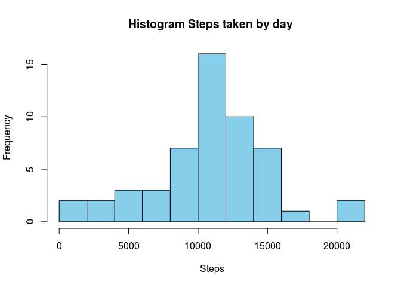
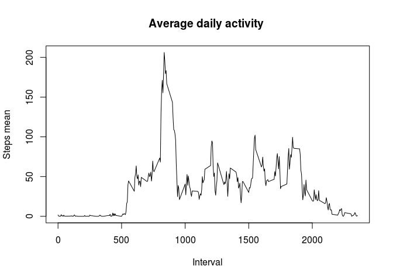
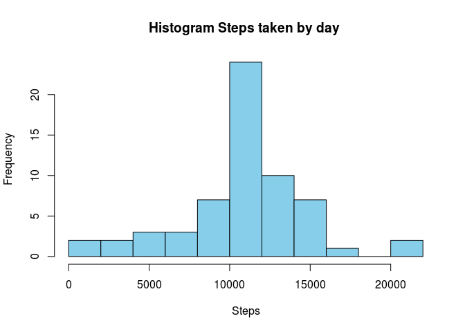
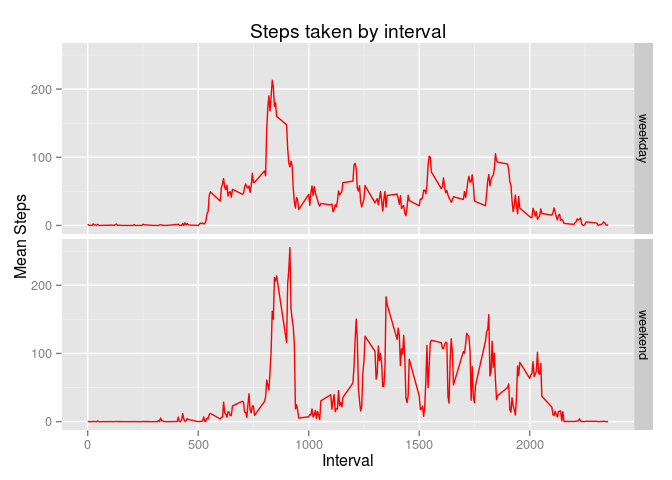

# Reproducible Research: Peer Assessment 1

This report contains the analisys and the information to reproduce projec1 of course Reproducible Research


## Loading and preprocessing the data

```r
setwd("/home/jandas/R/courseraR/RepResearch/Project1/Data")
## Call libraries
library(dplyr)
```

```
## 
## Attaching package: 'dplyr'
## 
## The following objects are masked from 'package:stats':
## 
##     filter, lag
## 
## The following objects are masked from 'package:base':
## 
##     intersect, setdiff, setequal, union
```

```r
library(ggplot2)


## Extract and transform data to keep it on correct formats
activity <- read.csv(unz("repdata-data-activity.zip", "activity.csv"), header=T, quote='"', colClasses=c(numeric(), character(), character()),row.names = NULL)
activity$date <- as.Date(activity$date)
```

 What is mean total number of steps taken per day?


```r
 # Calculate total number of steps taken everyday
activityDay = filter(activity, !is.na(steps)) # remove missing values
activityDay = group_by(activityDay, date)
activityDaySum<-summarize(activityDay, steps=sum(steps))
```


```r
hist(activityDaySum$steps, col="skyblue", breaks=12, main= "Histogram Steps taken by day ", xlab="Steps")
```

 
*** Figure 1: Histogram of steps taken by day

Mean of the total number of steps taken a day is 10766.19
Median of the total number of steps taken a day is 10765


```r
mean(activityDaySum$steps)
```

```
## [1] 10766.19
```

```r
median(activityDaySum$steps)
```

```
## [1] 10765
```

## What is the average daily activity pattern?


```r
activityInterval = group_by(activityDay, interval)
activityIntervalMean<-summarize(activityInterval, mean=mean(steps))
```


```r
plot(activityIntervalMean$interval, activityIntervalMean$mean, type="l", main= "Average daily activity ", xlab="Interval", ylab="Steps mean")
```

 
*** Figure 2: Average daily activity

### Which 5-minute interval, on average across all the days in the dataset, contains the maximum number of steps?

terval 835 contains the maximum number of steps which is 206.1698


```r
activityIntervalMean[activityIntervalMean$mean==max(activityIntervalMean$mean),]
```

```
## Source: local data frame [1 x 2]
## 
##   interval     mean
## 1      835 206.1698
```

## Imputing missing values

The data set contains 2304 records with missing values. 


```r
nrow(filter(activity, is.na(steps)))
```

```
## [1] 2304
```

### 5-minute interval strategy was used as a strategy to fill missing values and avoid noise in the graph.


```r
##Create a new dataset that is equal to the original dataset but with the missing data filled in.
activityfilled<-left_join(activity,activityIntervalMean, by="interval")
activityfilled<-transform(activityfilled, steps=ifelse(is.na(steps), mean, steps))

## Group by date
activityfilledDay = group_by(activityfilled, date)
activityfilledDaySum<-summarize(activityfilledDay, steps=sum(steps))
```


## Do these values differ from the estimates from the first part of the assignment? What is the impact of imputing missing data on the estimates of the total daily number of steps?

Filling missing data only changed the median value, which is the same as the mean.10766.19. 
Graph (Figure 3) shows similar data as the information from the data set without missing values (figure 1)


```r
#Mean
mean(activityfilledDaySum$steps)
```

```
## [1] 10766.19
```

```r
#Median
median(activityfilledDaySum$steps)
```

```
## [1] 10766.19
```


```r
hist(activityfilledDaySum$steps, col="skyblue", breaks=12, main= "Histogram Steps taken by day ", xlab="Steps")
```

 
Figure 3


```r
#Mean
mean(activityfilledDaySum$steps)
```

```
## [1] 10766.19
```

```r
#Median
median(activityfilledDaySum$steps)
```

```
## [1] 10766.19
```

## Are there differences in activity patterns between weekdays and weekends?

```r
activityfilled$weektype<-factor(ifelse(as.POSIXlt(activityfilled$date)$wday<6, "weekday","weekend"))
activityfilledWeek = group_by(activityfilled, interval, weektype)
activityfilledWeekMean<-summarize(activityfilledWeek, steps=mean(steps))
```


```r
g <-ggplot(activityfilledWeekMean, aes(interval, steps)) + geom_line(color="red")  +  facet_grid(weektype ~ .)+ labs(x= "Interval") + labs(y= "Mean Steps") + labs(title = "Steps taken by interval")
print(g)
```

 
Figure 4
